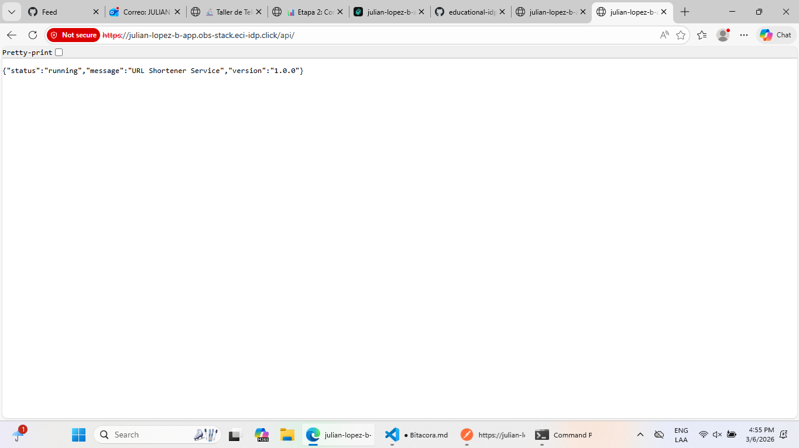
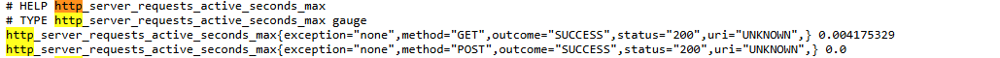
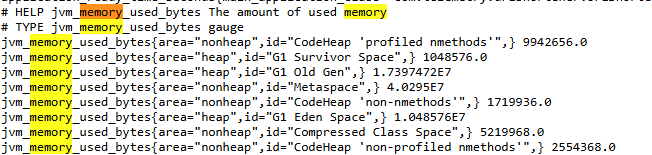
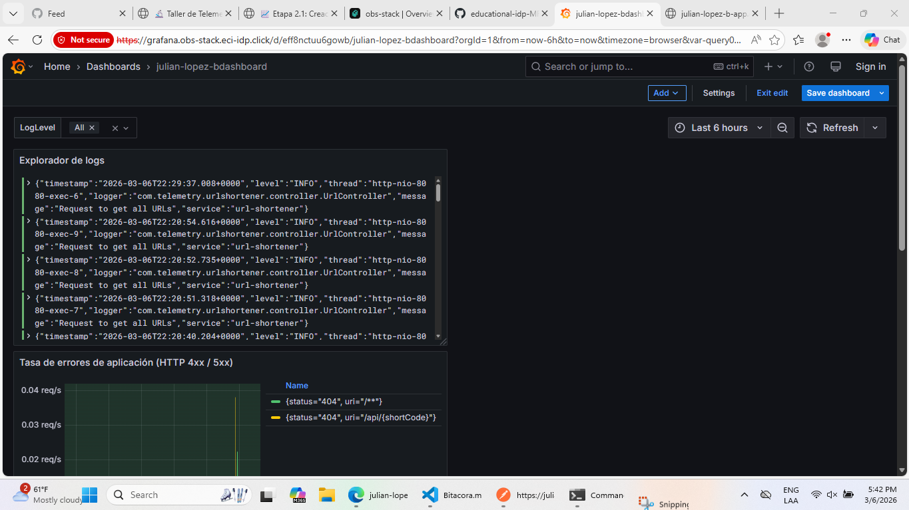
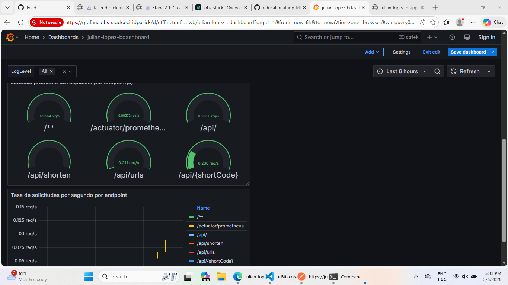
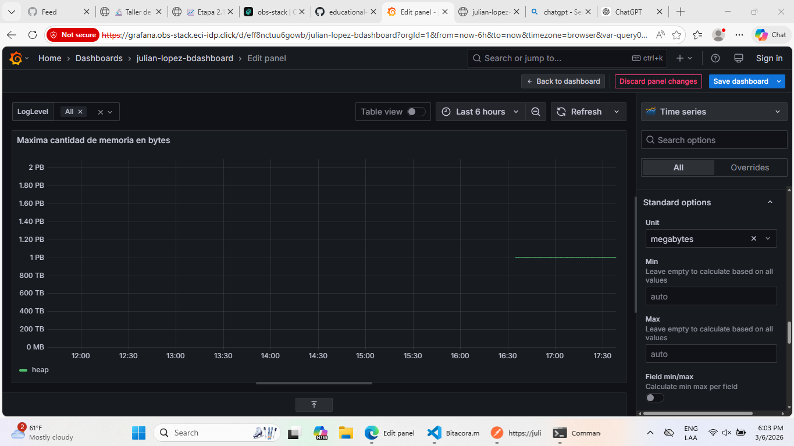
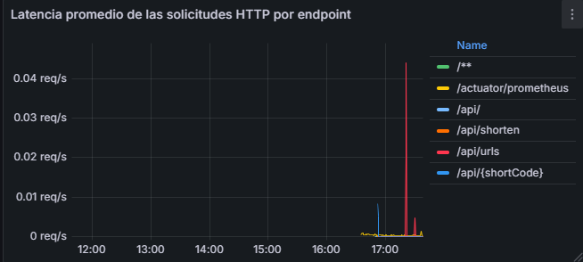
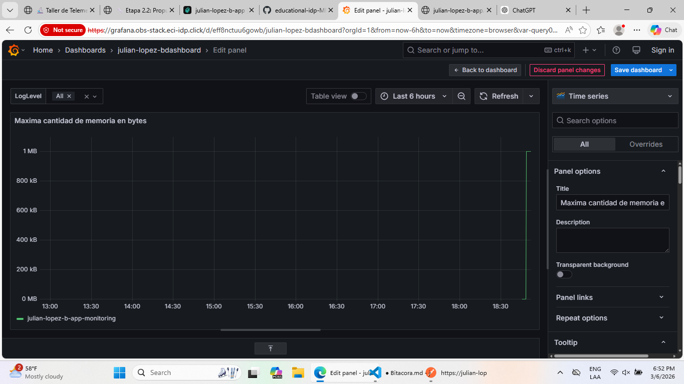

# Bitácora Experimento - Observabilidad y Monitoreo

**Nombre del estudiante:** Julian Camilo Lopez Barrero
--- 
Cuando acabes no olvides ayudarnos evaluando tu ⭐[experiencia](https://forms.office.com/r/JCyhCpujrt)⭐
---

## Tabla de Contenidos
- [Etapa 1: Preparación del Ambiente](#etapa-1-preparación-del-ambiente)
- [Etapa 2: Métricas Iniciales](#etapa-2-métricas-iniciales)
- [Etapa 2.1: Dashboard Base en Grafana](#etapa-21-dashboard-base-en-grafana)
- [Etapa 2.2: Propuesta de Métrica Personalizada](#etapa-22-propuesta-de-métrica-personalizada)
- [Etapa 3: Experimentación y Análisis del Sistema](#etapa-3-experimentación-y-análisis-del-sistema)

---

## Etapa 1: Preparación del Ambiente

### 1.1. Información de la aplicación

### 1.2. Verificación del despliegue

**¿La aplicación se desplegó correctamente?** 

- [X] Sí
- [ ] No

**Captura de pantalla de la aplicación funcionando:**

> _[Inserta aquí la imagen de la aplicación corriendo en /api/]_


### 1.3. Observaciones y problemas encontrados (opcional)

Creo que ninguno :)

## Etapa 2: Métricas Iniciales

### 2.0.1. Generación de tráfico

**Endpoints probados:**

- [X] `GET /api/`
- [X] `POST /api/shorten`
- [X] `GET /api/{shortCode}` No sirve
- [X] `GET /api/urls`


### 2.0.2. Análisis de dos métricas relevantes

#### Métrica 1

**Nombre de la métrica:**  
```
http_server_request_active_seconds_max
```

---
**Tipo de métrica:** 
- [ ] Counter
- [X] Gauge 
- [ ] Histogram 
- [ ] Summary

**Descripción de qué información aporta:**
```
Tiene el maximo de segundos que tarda una peticion solicitada que este activa en el servidor 

```

**Relación con otras métricas (si aplica):**
```
Ejemplo: Un aumento en peticiones HTTP podría influir en el uso de CPU


```

**¿En que escenarios puede ayudar esta métrica?**
```
Podria ayduar en un  caso donde se tengan muchas solicitudes y se quiera probar si el sistema responde bien y si los tiempos o la latencia es buena en el servidor

```

**¿Qué etiquetas (labels) se utilizan para agrupar los datos?**
```
Ejemplo: uri, method, status, instance, job, etc.

```
Tiene exception, method, outcome, status y uri
---

#### Métrica 2


**Nombre de la métrica:**  
```
jvm_memory_used_bytes The amount of used memory
```

**Tipo de métrica:** 
- [ ] Counter
- [X] Gauge 
- [ ] Histogram 
- [ ] Summary

**Descripción de qué información aporta:**
```
La cantidad de memoria usada
```

**Relación con otras métricas (si aplica):**
```
Ejemplo: Un aumento en peticiones HTTP podría influir en el uso de CPU


```

**¿En que escenarios puede ayudar esta métrica?**
```
Puede ayudar cuando se realizan multiples solicitudes y el como el sistema actua en base a la memoria
```

**¿Qué etiquetas (labels) se utilizan para agrupar los datos?**
```
Ejemplo: uri, method, status, instance, job, etc.


```
Usa area y id
---

## Etapa 2.1: Dashboard Base en Grafana


### 2.1.1. Evidencia: Dashboard Base en Grafana con los 4 paneles iniciales

**Captura de pantalla del dashboard:**


---



### 2.1.2. Visualizaciónes Adicionales (Con las metricas actuales)

#### Visualización Adicional 1

**Propósito:**
```
¿Qué quieres analizar o mostrar? Menciona qué métrica(s) vas a usar


```

**Título del panel:**
```
Maxima cantidad de memoria en bytes
```

**Consulta (PromQL o LogQL):**
```
sum by(area) (
  jvm_memory_max_bytes{applicationName="julian-lopez-b-app-monitoring", area="heap"}
)```

**Tipo de visualización:** 
- [X] Time series
- [ ] Gauge
- [ ] Bar chart
- [ ] Stat
- [ ] Logs
- [ ] Otro: _____

**Otros ajustes aplicados (colores, unidades, etc.) (opcional):**
```
Leyend -> Table, Rigth

Unit ->a megabytes

```

**Captura de pantalla:**



**Análisis (2-3 frases):**

```
El eje vertical muestra valores en petabytes (PB) y terabytes (TB), lo cual es un indicativo de que la métrica está representando números muy grandes.

```
---

#### Visualización Adicional 2

**Propósito:**
```
¿Qué quieres analizar o mostrar? Menciona qué métrica(s) vas a mostrar

Quiero mostrar la metrica 
http_server_requests_active_seconds_max

```

**Título del panel:**
```
Latencia promedio de las solicitudes HTTP por endpoint
```

**Consulta (PromQL o LogQL):**
```
Consejo: Si usaste la interfaz de Grafana para crear el panel, puedes copiar la consulta que se muestra en la caja de texto de la seccion Code.

sum by(uri) (
  rate(http_server_requests_seconds_sum{applicationName="julian-lopez-b-app-monitoring"}[1m])
)
```

**Tipo de visualización:** 
- [X] Time series
- [ ] Gauge
- [ ] Bar chart
- [ ] Stat
- [ ] Logs
- [ ] Otro: _____

**Otros ajustes aplicados (colores, unidades, etc.) (opcional):**
```
Unit -> requests/sec

```

**Captura de pantalla:**



**Análisis (2-3 frases):**
```
¿Qué conclusiones o patrones observas?


La mayoría de los endpoints presentan valores cercanos a 0, lo que indica que el número de solicitudes procesadas en el intervalo observado es bajo. No mande suficientes endpoints para que tuviera mucha carga la API

```

---

### 2.1.3. Análisis final del dashboard

**¿Qué otros datos te gustaría visualizar si tuvieras más información disponible?**
```
Los usuarios conectados a la API podria ser :)

```

---

## Etapa 2.2: Propuesta de Métrica Personalizada


### Análisis y propuesta de la métrica propia (en Java)

**1. Nombre de la métrica:**
```
Ejemplo: url_shortener_urls_created_total

customerCounter_total 
```

**2. Tipo de métrica:**
- [X] Counter
- [ ] Gauge

**3. ¿Qué comportamiento mide?**
```

Mide la cantidad de intentos de registrar un código personalizado que ya existe en el sistema. 
Cada incremento indica que un usuario trató de acortar una URL con un código que ya estaba en uso. 
Es un indicador de conflictos en la asignación de códigos personalizados.

```

**4. ¿Por qué es relevante para el sistema?**
```
Es relevante porque permite identificar problemas de experiencia de usuario y posibles cuellos de botella en la generación de códigos.
Un alto número de intentos duplicados puede señalar que los usuarios están eligiendo patrones comunes, lo que puede requerir ajustes en la lógica de generación automática de códigos o mejoras en la interfaz de usuario para guiar la selección de códigos válidos.
Además, ayuda a monitorear la eficiencia del sistema y a prevenir errores repetitivos que podrían afectar la confiabilidad y la percepción del servicio.

```


---

### Visualización en Grafana

**1. ¿Qué tipo de panel usaste en Grafana?**

- [X] Time series  
- [ ] Gauge  
- [ ] Stat  
- [ ] Bar chart  
- [ ] Otro: _____

**2. ¿Qué consulta PromQL vas a utilizar?**
```promql

sum by(applicationName) (
  customerCounter_total{applicationName="julian-lopez-b-app-monitoring"}
)

```

**3. ¿Cuál es el propósito de la visualización?**
```
Provee una interpretación en palabras con el propósito de la visualización. Que te interesa ver en el panel?

El panel muestra cuántas veces los usuarios intentaron usar un código personalizado que ya estaba en uso. Cada incremento en la métrica representa un conflicto en la asignación de códigos

```

---

### Panel creado en Grafana

**Captura de pantalla del panel en Grafana:**


---

## Etapa 3: Experimentación y Análisis del Sistema

### 3.1. Detección de anomalías y puntos de interés

**1. Como describirias la anomalía?**

```java
//ERROR 1 IDENTIFICADO
    private void maybeFail(String endpointName) {
        if (shouldFail()) {
            RuntimeException ex = new RuntimeException("Unexpected failure in " + endpointName);
            logger.error("Failure in {}: {}", endpointName, ex.getMessage(), ex);
            throw ex;
        }
    }

```

**2. Que paneles te ayudaron a identificarlo?**

``` 
El panel de los logs
Unexpected failure in POST /shorten\n\tat com.telemetry.urlshortener.controller.UrlController.maybeFail(UrlController.java:34)\n\tat com.telemetry.urlshortener.controller.UrlController.shortenUrl(UrlController.java:55)\n\tat java.base/jdk.internal.reflect.DirectMethodHandleAccessor.invoke(Unknown Source)\n\tat java.base/java.lang.reflect.Method.invoke(Unknown Source)\n\tat org.springframework.web.method.support.InvocableHandlerMethod.doInvoke(InvocableHandlerMethod.java:254)\n\tat org.springframework.

```

**3. Cual podria ser la causa de la anomalía?**

``` 


```

**Captura de pantalla del dashboard mostrando la anomalía:**

> _[Inserta aquí la imagen]_

---

### 3.2. Intento de corrección de anomalías


#### 3.2.1. Modificación del código

**Descripción del ajuste realizado:**
```
Describe en pocas palabras el ajuste realizado.


```

#### 3.2.2. Resultados después del despliegue

**¿El ajuste surtió efecto?**
- [ ] Sí 
- [ ] No 
- [ ] Parcialmente


**Captura de pantalla del dashboard después del ajuste:**

> _[Inserta aquí la imagen del estado del dashboard posterior al ajuste]_

---

### 5.7. Reflexión final

**¿Qué panel te resultó más útil para detectar problemas?**
```


```

**¿Qué métrica aporta mayor valor para monitorear un sistema real?**
```


```

**¿Qué agregarías o mejorarías en tu dashboard?**
```


```

**Fin de la bitácora**
